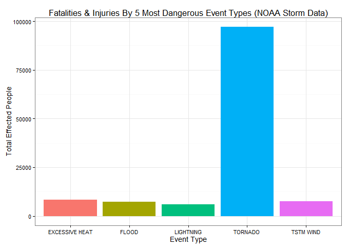
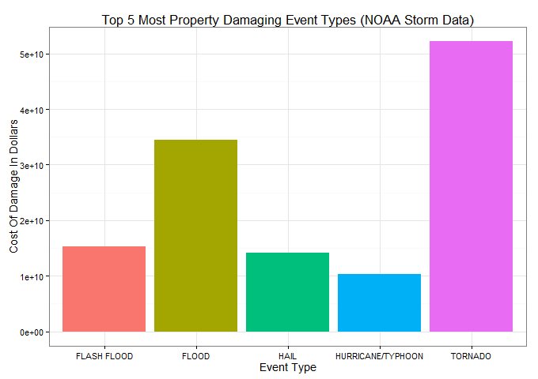
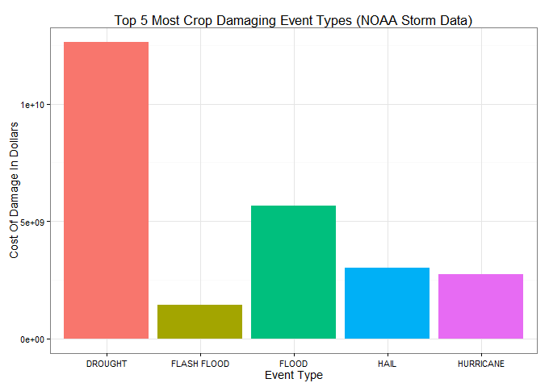

# Reproducible Research: Peer Assessment 2
By Pradeep Pereira  
Saturday, March 21, 2015  
## Title: Analysis of Storm Data(NOAA) In U.S.A: The Effect of Severe Weather EVents on Health and Economy in Local Communities


## Synopsis: 
The purpose of this analysis is to study the NOAA Storm Data data set for the U.S.A and interpret the effect of events (Tornadoes, Floods, Drought etc) on the population in two parts viz.

Part 1: HEALTH HAZARD ANALYSIS - Is directed at finding the effects of these events as a health hazard (fatalities & injuries)

Part 2: ECONOMIC DAMAGE ANALYSIS - Is directed at finding the effects of these events on the economies of the communities, broken down by property damage and crop damage. 

Results are graphically represented titled:

Part 1 Analysis: Fatalities & Injuries By 5 Most Dangerous Event Types (NOAA Storm Data)

Part 2 Analysis: Top 5 Most Property Damaging Event Types (NOAA Storm Data)
and Top 5 Most Crop Damaging Event Types (NOAA Storm Data)


## Data Processing: 

Download the storm data file from the specified URL and read it into a table


```r
#Download and load the data
#download.file("http://d396qusza40orc.cloudfront.net/repdata%2Fdata%2FStormData.csv.bz2", "StormData.csv.bz2")
StormData <- read.table("StormData.csv.bz2", fill=TRUE, sep=",", header=TRUE, as.is=TRUE, blank.lines.skip=TRUE)
```

Load the two main libraries we will use for data processing


```r
#Load the two main libraries we will use for all the data transformation
#needed for the analysis and graphical representation of the end results
library(dplyr)
```

```
## 
## Attaching package: 'dplyr'
## 
## The following object is masked from 'package:stats':
## 
##     filter
## 
## The following objects are masked from 'package:base':
## 
##     intersect, setdiff, setequal, union
```

```r
library(ggplot2)
```

Convert the event type column 'EVTYPE' of the loaded data set, to factor data type


```r
#Convert the event type column to factor data type
StormData$EVTYPE <- as.factor(StormData$EVTYPE)

#Start dplyr package functions for further processing
StormData<-tbl_df(StormData)

#Select only the subset of columns we need for our analysis
#viz. EVTYPE, FATALITIES, INJURIES, PROPDMG, PROPDMGEXP, CROPDMG, CROPDMGEXP
StormDataForAnalysis<-select(StormData,EVTYPE,FATALITIES,INJURIES,PROPDMG,PROPDMGEXP,CROPDMG,CROPDMGEXP)

#Do a quick visual check
head(StormDataForAnalysis,5)
```

```
## Source: local data frame [5 x 7]
## 
##    EVTYPE FATALITIES INJURIES PROPDMG PROPDMGEXP CROPDMG CROPDMGEXP
## 1 TORNADO          0       15    25.0          K       0           
## 2 TORNADO          0        0     2.5          K       0           
## 3 TORNADO          0        2    25.0          K       0           
## 4 TORNADO          0        2     2.5          K       0           
## 5 TORNADO          0        2     2.5          K       0
```

##Analysis Details
We break up the analysis into two parts. 

### Part 1: HEALTH HAZARD ANALYSIS
Part 1 applies to the health hazards (fatalities & injuries) suffered by the effected population on account of these events.

Run the analysis on the subset of data as applicable to fatalities and injuries.


```r
#Subset only health hazard stats from our parent data set
HHData<-select(StormDataForAnalysis,EVTYPE:INJURIES)

#From this select only rows that have either one fatality or injury
HHDataFiltered<-filter(HHData,FATALITIES>0 | INJURIES>0)

#Add a new column TOTAL that sums up the FATALITIES and INJURIES
HHDataMutated<-mutate(HHDataFiltered, TOTAL = FATALITIES + INJURIES)

#Aggregate the data on the EVTYPE column and sum the TOTAL column
HHDataAggregated<-aggregate(TOTAL ~ EVTYPE,HHDataMutated, sum)

#Arrange by TOTAL descending
HHDataFinal<-arrange(HHDataAggregated,desc(TOTAL))

#We will take only the top five most dangerous events that 
#pose a health hazard for the population
HHDataFinal<-head(HHDataFinal,5)

#Create our plot and save it to a png file
png("./FatalitiesInjuresStormData.png", width=680,height=480, units="px",bg="white")
HHDataFinalggplot <- ggplot(HHDataFinal,aes(EVTYPE,TOTAL,fill=EVTYPE)) + 
        geom_bar(stat="identity") + 
        theme_bw(base_size=14) + guides(fill=FALSE)+ 
        #facet_grid(.~EVTYPE,scales = "free_x",space="free") +  
        labs(x="Event Type", y="Total Effected People") +  
        labs(title="Fatalities & Injuries By 5 Most Dangerous Event Types (NOAA Storm Data)") 
print(HHDataFinalggplot)
dev.off()
```

```
## png 
##   2
```


### Part 2: ECONOMIC DAMAGE ANALYSIS
Part 2 applies to the economic effects on the communities of the effected population as inflicted by these event types. 

This is further broken down by two categories, property damage and crop damage.

First select the subset of data as applicable to property and crop damage.


```r
#Subset only property and crop damage stats from our parent data set
EDData<-select(StormDataForAnalysis,EVTYPE,PROPDMG:CROPDMGEXP)

#From this select only rows where there is either property or crop damage
EDDataFiltered<-filter(EDData,PROPDMG>0 | CROPDMG>0)
```

Split up the economic damage analysis further into two parts

#### Part 2.1: ECONOMIC DAMAGE ANALYSIS - Property Damage

Run the analysis on the subset of data as applicable to property damage only.

The results (see below) of this portion of the analyis is a graphical representation titled - "Top 5 Most Property Damaging Event Types (NOAA Storm Data)"


```r
#Add a new column to the economic damage parent data set quantifying cost of crop damage using the following factors
#The new column PROPDMGCOST is calculated by multiplying the value in PROPDMG by the value of the factor in PROPDMGEXP
#We use the factor to value translation as below
#H=100, K=1000, M-1000000, B=1000000000 anything else we leave the value as is

EDDataMutatedProp<-mutate(EDDataFiltered, 
        PROPDMGCOST = ifelse(PROPDMGEXP=="H", PROPDMG*100,
                             ifelse(PROPDMGEXP=="K", PROPDMG*1000, 
                                    ifelse(PROPDMGEXP=="M", PROPDMG*1000000, ifelse(PROPDMGEXP=="B", PROPDMG*100000000, PROPDMG)))))

#Aggregate the data by event type and sum on the property damage cost column
EDDataAggregatedProp<-aggregate(PROPDMGCOST ~ EVTYPE,EDDataMutatedProp, sum)

#Arrange by property damage cost - descending
EDDataPropFinal<-arrange(EDDataAggregatedProp,desc(PROPDMGCOST))

#We will take only the top five most property damaging events by cost of damages
EDDataPropFinal<-head(EDDataPropFinal,5)

#Create our plot for property damage analysis and save it to a png file
png("./PropertyDamageStormData.png", width=680,height=480, units="px",bg="white")
EDDataPropFinalggplot <- ggplot(EDDataPropFinal,aes(EVTYPE,PROPDMGCOST,fill=EVTYPE)) + 
        geom_bar(stat="identity") + 
        theme_bw(base_size=14) + guides(fill=FALSE)+ 
        #facet_grid(.~EVTYPE,scales = "free_x",space="free") +  
        labs(x="Event Type", y="Cost Of Damage In Dollars") +  
        labs(title="Top 5 Most Property Damaging Event Types (NOAA Storm Data)") 
print(EDDataPropFinalggplot)
dev.off()
```

```
## png 
##   2
```

#### Part 2.2: ECONOMIC DAMAGE ANALYSIS - Crop Damage

Run the analysis on the subset of data as applicable to crop damage only.

The results (see below) of this portion of the analyis is a graphical representation titled - "Top 5 Most Crop Damaging Event Types (NOAA Storm Data)"


```r
#Add a new column to the economic damage parent data set quantifying cost of crop damage using the following factors
#The new column CROPDMGCOST is calculated by multiplying the #value in CROPDMG by the value of the factor in CROPDMGEXP
#We use the factor to value translation as below
#H=100, K=1000, M-1000000, B=1000000000 anything else we leave the value as is

#Create a table of only crop damage stats from our economic damage parent data set
EDDataMutatedCrop<-mutate(EDDataFiltered, 
        CROPDMGCOST = ifelse(CROPDMGEXP=="H", CROPDMG*100,
                             ifelse(CROPDMGEXP=="K", CROPDMG*1000, 
                                    ifelse(CROPDMGEXP=="M", CROPDMG*1000000, ifelse(CROPDMGEXP=="B", CROPDMG*100000000, CROPDMG)))))

#Aggregate the data by event type and sum on the crop damage cost column
EDDataAggregatedCrop<-aggregate(CROPDMGCOST ~ EVTYPE,EDDataMutatedCrop, sum)

#Arrange by crop damage cost - descending
EDDataCropFinal<-arrange(EDDataAggregatedCrop,desc(CROPDMGCOST))

#We will take only the top five most crop damaging events by cost of damages
EDDataCropFinal<-head(EDDataCropFinal,5)

#Create our plot for crop damage analysis and save it to a png file
png("./CropDamageStormData.png", width=680,height=480, units="px",bg="white")
EDDataCropFinalggplot <- ggplot(EDDataCropFinal,aes(EVTYPE,CROPDMGCOST,fill=EVTYPE)) + 
        geom_bar(stat="identity") + 
        theme_bw(base_size=14) + guides(fill=FALSE)+ 
        #facet_grid(.~EVTYPE,scales = "free_x",space="free") +  
        labs(x="Event Type", y="Cost Of Damage In Dollars") +  
        labs(title="Top 5 Most Crop Damaging Event Types (NOAA Storm Data)") 
print(EDDataCropFinalggplot)
dev.off()
```

```
## png 
##   2
```

## Results:

### Part 1: HEALTH HAZARD ANALYSIS




### Part 2: ECONOMIC DAMAGE ANALYSIS

#### Part 2.1: ECONOMIC DAMAGE ANALYSIS - Property Damage



#### Part 2.2: ECONOMIC DAMAGE ANALYSIS - Crop Damage


